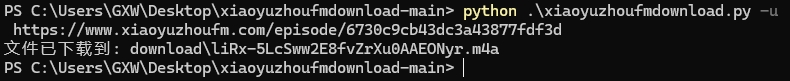
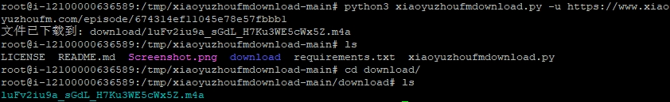

# 小宇宙FM播客音频下载器

## 项目描述

这是一个简单的Python脚本，用于从小宇宙FM网站下载音频文件。该脚本能够从给定的网页URL中提取音频链接，并将音频文件下载到本地。

## 功能特点

- 从小宇宙FM网页中自动提取音频文件URL
- 脚本将自动在运行路径中创建名为`download`的文件夹，用于保存所下载的音频文件
- 支持多种URL提取方式（meta标签、audio标签、JSON-LD）
- 命令行参数支持
- 处理重定向和网络请求

## 效果示例

Windows(PowerShell):

Linux:


## 环境要求

- Python 3.7+
- pip
- unzip 或其他解压工具

## 依赖项列表

- requests
- beautifulsoup4
- argparse（Python标准库）

## 使用方法

### 对于Windows(PowerShell)用户

1. 点击右上角`Code`
2. 点击`Download ZIP`，将项目保存到本地
3. 解压后打开文件夹，按住键盘`Shift`按钮的同时，在文件夹内空白处点击鼠标右键，点击`在此处打开Powershell`按钮
4. 运行`pip install -r requirements.txt`,安装项目所需依赖环境
5. 运行`python xiaoyuzhoufmdownload.py -u <音频网页URL>`，下载所需音频文件

### 对于Linux / MacOS用户

1. 克隆项目到本地：
```bash
curl -L -o xiaoyuzhoufmdownload.zip https://github.com/david-bowiegxw/xiaoyuzhoufmdownload/archive/refs/heads/main.zip
```
or
```bash
wget -O xiaoyuzhoufmdownload.zip https://github.com/david-bowiegxw/xiaoyuzhoufmdownload/archive/refs/heads/main.zip
```

2. 解压
```bash
unzip xiaoyuzhoufmdownload.zip
```

3. 进入项目文件夹：
```bash
cd xiaoyuzhoufmdownload-main
```
4. 安装依赖环境
```bash
sudo apt install python3-bs4 python3-requests
```
or（不推荐此方法，详细请参考常见问题）
```bash
pip install -r requirements.txt
```
5. 运行脚本
```bash
python3 xiaoyuzhoufmdownload.py -u <音频网页URL>
```

## 下载示例

```bash
python xiaoyuzhoufmdownload.py -u https://www.xiaoyuzhoufm.com/episode/6740632c8d1233fb0d3a9cea
```

脚本将在`download`文件夹中保存音频文件。

## 常见问题

- 如果遇到权限问题，可以尝试在命令前添加 `sudo`（仅限 macOS/Linux）
- 如果安装失败，请检查 pip 是否为最新版本：`pip install --upgrade pip`
- 对于基于Debian的Linux发行版，不推荐直接使用`pip`安装依赖，因为基于Debian的Linux发行版`eg. Ubuntu`主要依赖`apt`包管理系统，确保软件包与系统发行版一致、处理依赖关系和安全更新。`pip`安装的Python包可能引入不兼容依赖，且需要手动管理更新，可能导致安全漏洞。此外，`apt`安装的软件包与系统集成更好，自动处理权限问题，确保系统稳定和安全。
- 如果已经安装了`Streamlit`，安装依赖时可能会报错，原因是`requests`和`Streamlit`等其他依赖版本间存在冲突，请考虑手动指定`requests`的版本，建议指定为`requests>=2.27.0,<3.0.0`
- 如果你在 macOS 上使用较新的系统（如 macOS Catalina 或更高版本），可能会遇到`unzip`命令解压某些 .zip 文件时出现乱码的问题。这是因为 macOS 自带的`unzip`版本较旧，不支持某些编码。你可以考虑使用`The Unarchiver`或`Keka` 等第三方工具来解决这个问题。同样，你也可以尝试为系统安装更新版的`unzip`,方法如下：
1. 打开终端（Terminal），安装`Homebrew`（安装过程会提示你输入管理员密码）：
```bash
/bin/bash -c "$(curl -fsSL https://raw.githubusercontent.com/Homebrew/install/HEAD/install.sh)"
```
2. 使用`Homebrew`安装更新版本的`unzip`：
```bash
brew install unzip
```

- 在某些 Linux 发行版中，`unzip`可能没有默认安装。你可以自己安装，例如在 Ubuntu/Debian 上：

```bash
sudo apt-get install unzip
```
在 Fedora 上：
```bash
sudo dnf install unzip
```

## 注意事项

- 请确保遵守小宇宙FM的使用条款
- 仅用于个人学习和研究目的
- 请自觉尊重内容创作者的版权以及劳动成果

## 贡献

欢迎提交 Issues 和 Pull Requests！

## 免责声明

本脚本仅供学习交流，请勿二次传播，分发，修改，截取所下载的音频内容，请自觉遵守版权法。

## 作者

[david-bowiegxw/xiaoyuzhoufmdownload](https://github.com/david-bowiegxw/xiaoyuzhoufmdownload)

## 许可证

本项目采用 MIT 许可证。详细信息请参见 `LICENSE` 文件。

[](https://opensource.org/licenses/MIT)
