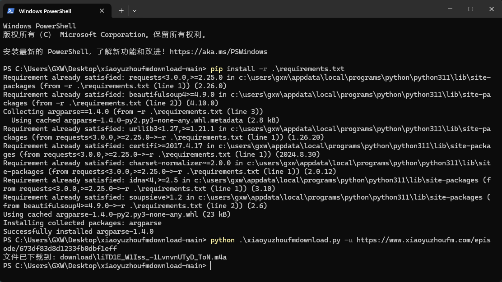

# 小宇宙FM播客音频下载器

## 项目描述

这是一个简单的Python脚本，用于从小宇宙FM网站下载音频文件。该脚本能够从给定的网页URL中提取音频链接，并将音频文件下载到本地。

## 功能特点

- 从小宇宙FM网页中自动提取音频文件URL
- 脚本将自动在运行路径中创建名为`download`的文件夹，用于保存所下载的音频文件
- 支持多种URL提取方式（meta标签、audio标签、JSON-LD）
- 命令行参数支持
- 处理重定向和网络请求

## 效果示例



## 环境要求

- Python 3.7+
- pip

## 项目克隆与设置

### Windows 用户

1. 克隆项目到本地：
```powershell
# 使用 PowerShell 或 Git Bash
git clone https://github.com/david-bowiegxw/xiaoyuzhoufmdownload.git
```

2. 进入项目文件夹：
```powershell
cd xiaoyuzhoufmdownload
```

### macOS/Linux 用户

1. 克隆项目到本地：
```bash
git clone https://github.com/david-bowiegxw/xiaoyuzhoufmdownload.git
```

2. 进入项目文件夹：
```bash
cd xiaoyuzhoufmdownload
```

## 快速运行

### Windows
```powershell
# 安装依赖
pip install -r requirements.txt

# 运行脚本（示例）
python xiaoyuzhoufmdownload.py -u <音频网页URL>
```

### macOS/Linux
```bash
# 安装依赖
pip3 install -r requirements.txt

# 运行脚本
python3 xiaoyuzhoufmdownload.py -u <音频网页URL>
```

## 示例

```bash
python xiaoyuzhoufmdownload.py -u https://www.xiaoyuzhoufm.com/episode/6740632c8d1233fb0d3a9cea
```

脚本将在`download`文件夹中保存音频文件。

## 注意事项

- 请确保遵守小宇宙FM的使用条款
- 仅用于个人学习和研究目的
- 请自觉尊重内容创作者的版权以及劳动成果

## 依赖项列表

- requests
- beautifulsoup4
- argparse（Python标准库）

## 常见问题解决

- 如果遇到权限问题，可以尝试在命令前添加 `sudo`（仅限 macOS/Linux）
- 建议使用 Python 3.7 及以上版本
- 如果安装失败，请检查 pip 是否为最新版本：`pip install --upgrade pip`

## 贡献

欢迎提交 Issues 和 Pull Requests！

## 免责声明

本脚本仅供学习交流，请勿二次传播，分发，修改，截取所下载的音频内容，请自觉遵守版权法。

## 作者

[david-bowiegxw/xiaoyuzhoufmdownload](https://github.com/david-bowiegxw/xiaoyuzhoufmdownload)

## 许可证

本项目采用 MIT 许可证。详细信息请参见 `LICENSE` 文件。

[](https://opensource.org/licenses/MIT)
